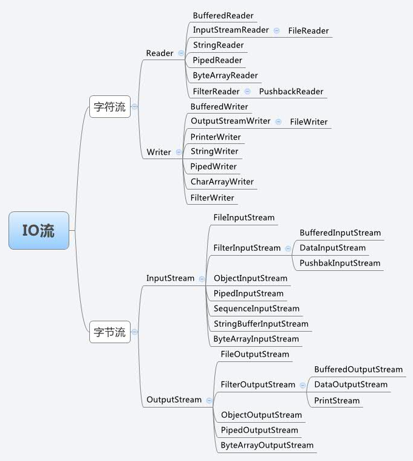
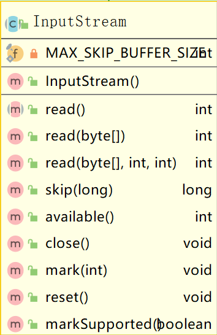
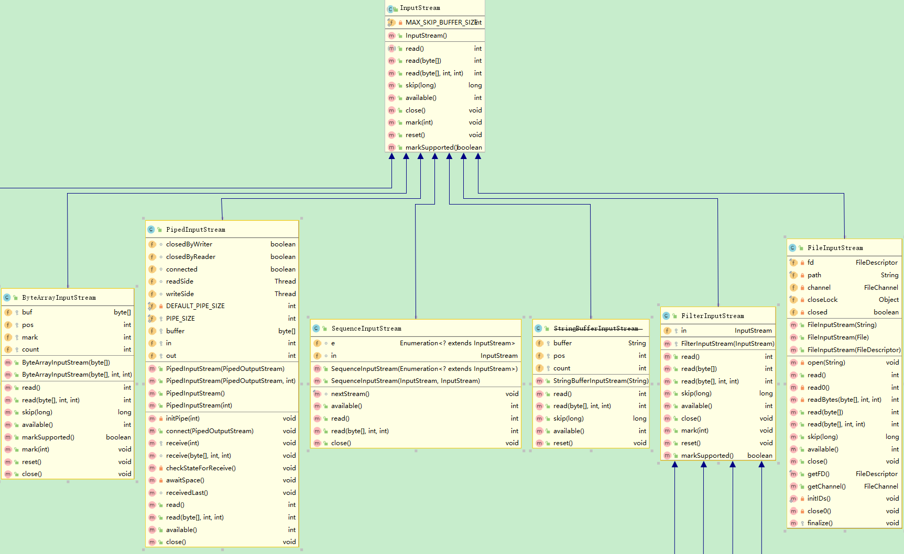

# Java.io

###思维导图



### 分类

#### 按数据处理类型分

1. 字节流

   Reader/Writer

   数据流中最小的数据单元是字节

2. 字符流

   InputStream/OutputStream

   数据流中最小的数据单元是字符， Java中的字符是Unicode编码，一个字符占用两个字节。因为数据编码的不同，而有了对字符进行高效操作的流对象。本质其实就是基于字节流读取时，去查了指定的码表


#### 按数据流向分

1. 输入流
2. 输出流


###接口

#### Closeable

所有IO相关类都实现该接口的close方法：

```java
/**
* Closes this stream and releases any system resources associated
* with it. If the stream is already closed then invoking this
* method has no effect.
*/
public void close() throws IOException;
```

关闭流并释放系统相关资源。如果流已经关闭，调用该方法不会产生任何影响。


#### Flushable

JDK5版本新增接口

调用flush方法可以任何缓冲的==输出==写入到基础流

```java
/**
 * A <tt>Flushable</tt> is a destination of data that can be flushed.  The
 * flush method is invoked to write any buffered output to the underlying
 * stream.
 *
 * @since 1.5
 */
public interface Flushable {

    /**
     * Flushes this stream by writing any buffered output to the underlying
     * stream.
     *
     * @throws IOException If an I/O error occurs
     */
    void flush() throws IOException;
}
```

实现类：

final class Console

abstract class Writer

abstract class OutputStream


#### DataOutput


#### DataInput

接口提供用于从二进制流中读取字节，并且从中重建任何形式的数据Java基本类型

DataInput和DataOutput接口的实现代表Unicode字符串，其格式是对UTF-8的略微修改。


### 类


####abstract class InputStream



子类：


