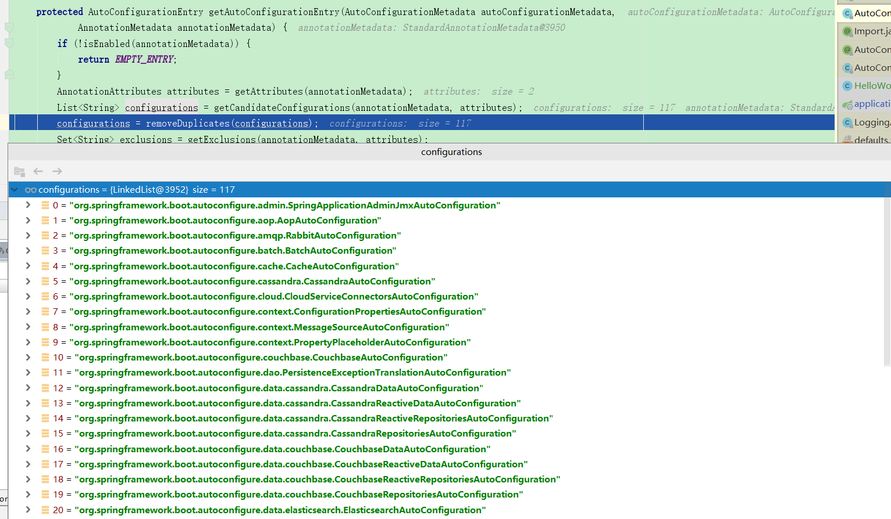

#Auto Configuration

###1.pom.xml

1.parent项目

```xml
<parent>
    <groupId>org.springframework.boot</groupId>
    <artifactId>spring-boot-starter-parent</artifactId>
    <version>2.1.11.RELEASE</version>
</parent>

parent's parent
<parent>
    <groupId>org.springframework.boot</groupId>
    <artifactId>spring-boot-parent</artifactId>
    <version>2.1.11.RELEASE</version>
    <relativePath>../spring-boot-parent</relativePath>
</parent>

parent's parent
<parent>
    <groupId>org.springframework.boot</groupId>
    <artifactId>spring-boot-dependencies</artifactId>
    <version>2.1.11.RELEASE</version>
    <relativePath>../spring-boot-dependencies</relativePath>
</parent>
```

spring-boot-dependencies的版本仲裁中心：自动注入依赖的jar及其版本都在该pom中定义

2.启动器

```xml
<dependency>
    <groupId>org.springframework.boot</groupId>
    <artifactId>spring-boot-starter-web</artifactId>
</dependency>
```

spring-boot-starter:spring boot场景启动器

参考：

https://docs.spring.io/spring-boot/docs/2.1.11.RELEASE/reference/html/using-boot-build-systems.html#using-boot-starter


### 2.主程序类


```java
/**
 * 入口类
 */
@SpringBootApplication
public class com.kafka.boot.ConsumerApplication {
    public static void main(String[] args) {
        SpringApplication.run(com.kafka.boot.ConsumerApplication.class);
    }
}
```

####@SpringBootApplication:

Spring boot的主配置类

spring boot定义的配置注解

```java
/**
 * 组合注解
 */
@Target(ElementType.TYPE)
@Retention(RetentionPolicy.RUNTIME)
@Documented
@Inherited
@SpringBootConfiguration
@EnableAutoConfiguration
@ComponentScan(excludeFilters = { @Filter(type = FilterType.CUSTOM, classes = TypeExcludeFilter.class),
		@Filter(type = FilterType.CUSTOM, classes = AutoConfigurationExcludeFilter.class) })
public @interface SpringBootApplication {
```

####@SpringBootConfiguration：

Spring boot配置类

```java
@Target(ElementType.TYPE)
@Retention(RetentionPolicy.RUNTIME)
@Documented
@Configuration
public @interface SpringBootConfiguration {
```

#####@Configuration

spring定义的配置注解

配置类---配置文件；配置类也是容器中的一个组件；类似于@Component


####@EnableAutoConfiguration：

开启自动配置功能

```java
@Target(ElementType.TYPE)
@Retention(RetentionPolicy.RUNTIME)
@Documented
@Inherited
@AutoConfigurationPackage
@Import(AutoConfigurationImportSelector.class)
public @interface EnableAutoConfiguration {
```

#####@AutoConfigurationPackage:

自动配置包，类似于spring的package-scan配置

```java
@Target(ElementType.TYPE)
@Retention(RetentionPolicy.RUNTIME)
@Documented
@Inherited
@Import(AutoConfigurationPackages.Registrar.class)
public @interface AutoConfigurationPackage {
```

@Import(AutoConfigurationPackages.Registrar.class):spring支持的导入注解，参数为需要导入的类

AutoConfigurationPackages.Registrar.class实现导入：

```java
/**
	 * {@link ImportBeanDefinitionRegistrar} to store the base package from the importing
	 * configuration.
	 */
static class Registrar implements ImportBeanDefinitionRegistrar, DeterminableImports {

    @Override
    public void registerBeanDefinitions(AnnotationMetadata metadata, BeanDefinitionRegistry registry) {
        register(registry, new PackageImport(metadata).getPackageName());
    }

    @Override
    public Set<Object> determineImports(AnnotationMetadata metadata) {
        return Collections.singleton(new PackageImport(metadata));
    }

}

```

参数AnnotationMetadata ：注解的元信息，将主配置类（@SpringBootApplication注解的类）所在的package及所有sub-package包含的所有组件扫描到Spring容器中。

#####@Import(AutoConfigurationImportSelector.class)

AutoConfigurationImportSelector.class：需要导入容器的组件选择器，将需要导入的组件以全类名的方式返回

```java
@Override
public String[] selectImports(AnnotationMetadata annotationMetadata) {
    if (!isEnabled(annotationMetadata)) {
        return NO_IMPORTS;
    }
    AutoConfigurationMetadata autoConfigurationMetadata = AutoConfigurationMetadataLoader
        .loadMetadata(this.beanClassLoader);
    AutoConfigurationEntry autoConfigurationEntry = getAutoConfigurationEntry(autoConfigurationMetadata,annotationMetadata);
    return StringUtils.toStringArray(autoConfigurationEntry.getConfigurations());
}
```

==AutoConfigurationEntry autoConfigurationEntry = getAutoConfigurationEntry(autoConfigurationMetadata,annotationMetadata);==

```java
/**
	 * Return the {@link AutoConfigurationEntry} based on the {@link AnnotationMetadata}
	 * of the importing {@link Configuration @Configuration} class.
	 * @param autoConfigurationMetadata the auto-configuration metadata
	 * @param annotationMetadata the annotation metadata of the configuration class
	 * @return the auto-configurations that should be imported
	 */
protected AutoConfigurationEntry getAutoConfigurationEntry(AutoConfigurationMetadata autoConfigurationMetadata,
                                                           AnnotationMetadata annotationMetadata) {
    if (!isEnabled(annotationMetadata)) {
        return EMPTY_ENTRY;
    }
    AnnotationAttributes attributes = getAttributes(annotationMetadata);
    List<String> configurations = getCandidateConfigurations(annotationMetadata, attributes);
    configurations = removeDuplicates(configurations);
    Set<String> exclusions = getExclusions(annotationMetadata, attributes);
    checkExcludedClasses(configurations, exclusions);
    configurations.removeAll(exclusions);
    configurations = filter(configurations, autoConfigurationMetadata);
    fireAutoConfigurationImportEvents(configurations, exclusions);
    return new AutoConfigurationEntry(configurations, exclusions);
}
```



==List<String> configurations = getCandidateConfigurations(annotationMetadata, attributes);==

```java
protected List<String> getCandidateConfigurations(AnnotationMetadata metadata, AnnotationAttributes attributes) {
    List<String> configurations = SpringFactoriesLoader.loadFactoryNames(getSpringFactoriesLoaderFactoryClass(),
                                                                         getBeanClassLoader());
    Assert.notEmpty(configurations, "No auto configuration classes found in META-INF/spring.factories. If you "
                    + "are using a custom packaging, make sure that file is correct.");
    return configurations;
}
```

==SpringFactoriesLoader.loadFactoryNames(getSpringFactoriesLoaderFactoryClass(),getBeanClassLoader());==

```java
public static List<String> loadFactoryNames(Class<?> factoryClass, @Nullable ClassLoader classLoader) {
    String factoryClassName = factoryClass.getName();
    return loadSpringFactories(classLoader).getOrDefault(factoryClassName, Collections.emptyList());
}
```

==loadSpringFactories(classLoader)==

```java
//public static final String FACTORIES_RESOURCE_LOCATION = "META-INF/spring.factories";
private static Map<String, List<String>> loadSpringFactories(@Nullable ClassLoader classLoader) {
    MultiValueMap<String, String> result = cache.get(classLoader);
    if (result != null) {
        return result;
    }

    try {
        Enumeration<URL> urls = (classLoader != null ?
                                 classLoader.getResources(FACTORIES_RESOURCE_LOCATION) :                             ClassLoader.getSystemResources(FACTORIES_RESOURCE_LOCATION));
        result = new LinkedMultiValueMap<>();
        while (urls.hasMoreElements()) {
            URL url = urls.nextElement();
            UrlResource resource = new UrlResource(url);
            Properties properties = PropertiesLoaderUtils.loadProperties(resource);
            for (Map.Entry<?, ?> entry : properties.entrySet()) {
                String factoryClassName = ((String) entry.getKey()).trim();
                for (String factoryName : StringUtils.commaDelimitedListToStringArray((String) entry.getValue())) {
                    result.add(factoryClassName, factoryName.trim());
                }
            }
        }
        cache.put(classLoader, result);
        return result;
    }   
}
```

==默认从spring-boot-autoconfigure-2.1.11.RELEASE.jar包下TA-INF/spring.factories中org.springframework.boot.autoconfigure.EnableAutoConfiguration指定的值作为自动配置类，导入容器中==


