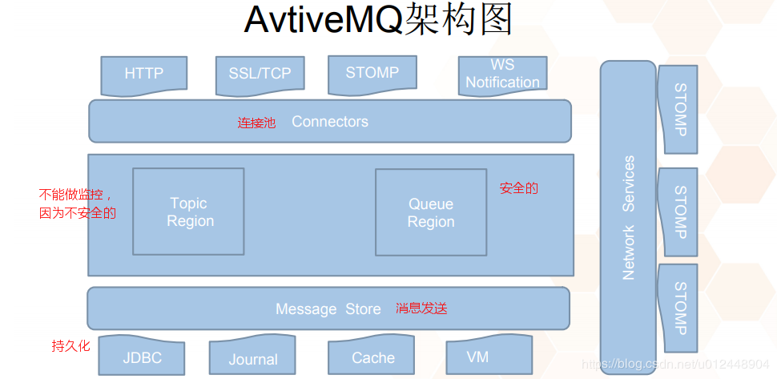

# ActiveMQ

UPAM项目目前使用的ActiveMQ 5.15.0版本

##介绍

基于JMS(Java Message Service)的消息中间件，对比RabbitMQ(ali),kafa(apache)

1.支持多种语言编写客户端

2.易于支持Spring

3.支持多种传输协议

​	TCP,SSL,NIO,UDP等

4.支持AJAX


##JMS属性

Destination

Productor

Consumer

Broker：消息转发器

Model：P2P, Pub/Sub

​	P2P--消息队列(Queue)，发送者(Sender)，接收者(Receiver)

​	Pub/Sub--主题(Topic)，发布者(Publisher)，订阅者(Subscriber)


##消息形式

topic：非安全，没有状态，一对多，数据容易丢失（不保存消息），传输速率高

queue：安全，有状态，一对一，数据不容易丢失（保存消息），传输速率低，分为同步/异步两种方式


##架构图




## springboot整合ActiveMQ


###maven依赖

```xml
<dependency>
    <groupId>org.springframework.boot</groupId>
    <artifactId>spring-boot-starter-activemq</artifactId>
</dependency>
```


###ActiveMQ配置

```tex
#AcitveMQ
#通信方式及地址
spring.activemq.broker-url=tcp://localhost:61616
#用户名
spring.activemq.user=admin
#密码
spring.activemq.password=admin
#session缓存大小
spring.jms.cache.session-cache-size=5
```


### 连接工厂ActiveMQConnectionFactory

连接到ActiveMQ的broker；创建连接

```java
ActiveMQConnectionFactory factory = new ActiveMQConnectionFactory(activeMQProperties.getBrokerUrl());
```


###连接(Connection)和会话(Session)

- JMS连接Connection/Session
- ActiveMQ实现的连接ActiveMQConnection/ActiveMQSession

连接需要调用开始(start)方法才可以进行接下来创建session的操作

```java
//JMS连接Connection
Connection connection = factory.createConnection(activeMQProperties.getUser(), activeMQProperties.getPassword());

//ActiveMQ实现的连接ActiveMQConnection
ActiveMQConnection activeMQConnection = (ActiveMQConnection) factory.createConnection("admin", "admin");
```


### 消息Message

实现消息的传递，JMS的顶级接口为Message

JMS实现的消息格式有以下几种

- BlobMessage
- BytesMessage
- MapMessage
- ObjectMessage
- StreamMessage
- TextMessage

每一种消息格式，ActiveMQ都用对应的实现

- ActiveMQBlobMessage
- ActiveMQBytesMessage
- ActiveMQMapMessage
- ActiveMQObjectMessage
- ActiveMQStreamMessage
- ActiveMQTextMessage


###生产者Producer

producer demo

```java
@Service
public class ProducerDemo {
    @Resource
    private ActiveMQProperties activeMQProperties;

    public void productMessage(){
        ActiveMQConnectionFactory factory = new ActiveMQConnectionFactory(activeMQProperties.getBrokerUrl());
        try {
            //create JMS connection
            Connection connection = factory.createConnection(activeMQProperties.getUser(), activeMQProperties.getPassword());
            connection.start();

            //two ways to send message
            //1.JMS producer
            //create session
            Session session = connection.createSession(false, JmsProperties.AcknowledgeMode.AUTO.getMode());
            //if support transaction
//          Session session = connection.createSession(false, Session.SESSION_TRANSACTED);

            //create Destination
            Queue producerQ = session.createQueue("producer");
            MessageProducer producer = session.createProducer(producerQ);
            producer.setDeliveryMode(DeliveryMode.PERSISTENT);
            producer.send(session.createTextMessage("producer test"));

            //2.ActiveMQ sender
            ActiveMQSession activeMQSession = (ActiveMQSession) connection.createSession(false, JmsProperties.AcknowledgeMode.AUTO.getMode());
            Queue senderQ = activeMQSession.createQueue("sender");
            QueueSender sender = activeMQSession.createSender(senderQ);
            ActiveMQTextMessage activeMQTextMessage = new ActiveMQTextMessage();
            activeMQTextMessage.setText("sender test");
            sender.send(activeMQTextMessage);

            //close connection, otherwise consumer/receiver can not get message
            connection.stop();
        } catch (JMSException e) {
            e.printStackTrace();
        }

    }
}
```


ActiveMQProperties类：ActiveMQ连接配置类。源码的核心内容如下

会自动匹配application.properties/yml等配置文件中，以"spring.activemq"开头的配置

```java
@ConfigurationProperties(prefix = "spring.activemq")
public class ActiveMQProperties {

	/**
	 * URL of the ActiveMQ broker. Auto-generated by default.
	 */
	private String brokerUrl;

	/**
	 * Login user of the broker.
	 */
	private String user;

	/**
	 * Login password of the broker.
	 */
	private String password;
}	
```

####事物支持

```java
//if support transaction
Session session = connection.createSession(false, Session.SESSION_TRANSACTED);
//send message
...
//提交事物
session.commit();
```

####消息持久化

```java
producer.setDeliveryMode(DeliveryMode.PERSISTENT);
```


###消费者Consumer

对于Queue，在消费消息之后会删除消息，由以下源码可体现

```java
//FifoMessageDispatchChannel.java
//list的数据结构
private final LinkedList<MessageDispatch> list = new LinkedList();
//出队操作
public MessageDispatch dequeue(long timeout) throws InterruptedException {
    synchronized(this.mutex) {
        while(timeout != 0L && !this.closed && (this.list.isEmpty() || !this.running)) {
            if (timeout != -1L) {
                this.mutex.wait(timeout);
                break;
            }

            this.mutex.wait();
        }

        return !this.closed && this.running && !this.list.isEmpty() ? (MessageDispatch)this.list.removeFirst() : null;
    }
}
```


实现消息的消费有三种方式

- JMS:Connection, Session and MessageConsumer
- ActiveMQ:ActiveMQConnection, ActiveMQSession and ActiveMQQueueReceiver
- ActiveMQ:ActiveMQConnection, ActiveMQSession and MessageListener

其中第二种（MessageListener）和第三种方式（ActiveMQQueueReceiver）都是通过ActiveMQMessageConsumer类实现消息的消费操作。

不同点在于ActiveMQQueueReceiver的receive方法通过同步阻塞的方式接收消息，MessageListener通过异步监听的方式接收消息

```java
//ActiveMQQueueReceiver通过调用父类ActiveMQMessageConsumer的receive同步阻塞方式接收消息
public Message receive() throws JMSException {
    this.checkClosed();
    this.checkMessageListener();
    this.sendPullCommand(0L);
    MessageDispatch md = this.dequeue(-1L);
    if (md == null) {
        return null;
    } else {
        this.beforeMessageIsConsumed(md);
        this.afterMessageIsConsumed(md, false);
        //消息转换MessageDispatch -> Message
        return this.createActiveMQMessage(md);
    }
}

//MessageListener使用ActiveMQMessageConsumer的setMessageListener方法异步接收消息
public void setMessageListener(MessageListener listener) throws JMSException {
    this.checkClosed();
    if (this.info.getPrefetchSize() == 0) {
        throw new JMSException("Illegal ...");
    } else {
        if (listener != null) {
            boolean wasRunning = this.session.isRunning();
            if (wasRunning) {
                this.session.stop();
            }

            this.messageListener.set(listener);
            this.session.redispatch(this, this.unconsumedMessages);
            if (wasRunning) {
                this.session.start();
            }
        } else {
            this.messageListener.set((Object)null);
        }
    }
}
```


consumer demo

```java
@Service
public class ConsumerDemo {

    @Resource
    private ActiveMQProperties activeMQProperties;
    public String consumeMessage(){
        ActiveMQConnectionFactory factory = new ActiveMQConnectionFactory(activeMQProperties.getBrokerUrl());
        try {
            //create JMS connection
            Connection connection = factory.createConnection(activeMQProperties.getUser(), activeMQProperties.getPassword());
            //create JMS connection
            /*Connection connection = factory.createConnection("admin", "admin");
            connection.start();
            //create JMS session
            Session session = connection.createSession(false, JmsProperties.AcknowledgeMode.AUTO.getMode());
            Queue consumerQ = session.createQueue("producer");

            //get JMS consumer
            MessageConsumer consumer = session.createConsumer(consumerQ);
            //receive message
            TextMessage jmsMessage = (TextMessage) consumer.receive();
            System.out.println("consume message : " + jmsMessage.getText());
            session.close();
            connection.stop();*/


            ActiveMQConnection activeMQConnection = (ActiveMQConnection) factory.createConnection("admin", "admin");
            activeMQConnection.start();
            //create activemq session
            ActiveMQSession activeMQSession = (ActiveMQSession) activeMQConnection.createSession(false, JmsProperties.AcknowledgeMode.AUTO.getMode());
            //create activemq destination
            ActiveMQQueue des = (ActiveMQQueue) activeMQSession.createQueue("sender");

            //create activemq consumer
            /*ActiveMQQueueReceiver receiver = (ActiveMQQueueReceiver) activeMQSession.createReceiver(des);
            //consume message, the receive() method is sync and block
            ActiveMQTextMessage activeMQTextMessage = (ActiveMQTextMessage) receiver.receive();
            System.out.println("receive message : " + activeMQTextMessage.getText());
            activeMQConnection.stop();*/

            ActiveMQMessageConsumer activeMQSessionConsumer = (ActiveMQMessageConsumer) activeMQSession.createConsumer(des);
            activeMQSessionConsumer.setMessageListener(message -> {
                TextMessage textMessage = (TextMessage) message;
                try {
                    System.out.println("receive message : " + textMessage.getText());
                } catch (JMSException e) {
                    e.printStackTrace();
                }
            });

            return "";
        } catch (JMSException e) {
            e.printStackTrace();
        }
        return null;
    }
}
```


## ActiveMQ消息持久化

ActiveMQ消息持久化机制有

- JDBC
- AMQ
- KahaDB
- LevelDB

在安装目录下conf/acticvemq.xml文件中进行配置

注：除了要在配置文件中配置持久化外，需要在代码中设置producer是否进行消息持久化，默认非持久化

```java
producer.setDeliveryMode(DeliveryMode.PERSISTENT);
```


### JDBC持久化配置

####配置

需要先定义一个mysql-ds的MYSQL数据源

```xml
<bean id="mysql-ds" class="org.apache.commons.dbcp.BasicDataSource" destroy-method="close">
    <property name="driverClassName" value="com.mysql.jdbc.Driver"/>
    <property name="url" value="jdbc:mysql://localhost/activemq?relaxAutoCommit=true"/>
    <property name="username" value="activemq"/>
    <property name="password" value="activemq"/>
    <property name="maxActive" value="200"/>
    <property name="poolPreparedStatements" value="true"/>
</bean>
```

persistenceAdapter节点中配置jdbcPersistenceAdapter并且引用数据源

```xml
<persistenceAdapter> 
    <jdbcPersistenceAdapter dataSource="#mysql-ds" createTablesOnStartup="false" /> 
</persistenceAdapter>
```

createTablesOnStartup：ActiveMQ启动时是否创建数据库。一般在第一次启动时设置为true，以后都设置为false

#### 表结构

activemq_msgs表，用于存储Queue和Topic消息

```tex
ID：自增的数据库主键
CONTAINER：消息的Destination
MSGID_PROD：消息发送者客户端的主键
MSG_SEQ：是发送消息的顺序，MSGID_PROD+MSG_SEQ可以组成JMS的MessageID
EXPIRATION：消息的过期时间，存储的是从1970-01-01到现在的毫秒数
MSG：消息本体的Java序列化对象的二进制数据
PRIORITY：优先级，从0-9，数值越大优先级越高
```

activemq_acks表，用于存储订阅关系

```tex
CONTAINER：消息的Destination
SUB_DEST：如果是使用Static集群，这个字段会有集群其他系统的信息
CLIENT_ID：每个订阅者都必须有一个唯一的客户端ID用以区分
SUB_NAME：订阅者名称
SELECTOR：选择器，可以选择只消费满足条件的消息。条件可以用自定义属性实现，可支持多属性AND和OR操作
LAST_ACKED_ID：记录消费过的消息的ID
```

activemq_lock表，在集群环境可用。在集群环境下，只有一个Broker可以获得消息，成为Master Broker。这个表用于记录哪个Broker是当前的Master Broker


###AMQ持久化配置

优点：性能高于JDBC，直接将消息顺序追加到日志文件。为了提升性能，创建消息主键索引，并提供缓存机制。每个日志文件大小有限制（可配置）。

缺点：AMQ Message会为每一个Destination创建一个索引，如果使用了大量的Queue，索引文件的大小会占用很多磁盘空间。而且由于索引巨大，一旦Broker崩溃，重建索引的速度会非常慢。

#### 配置

```xml
<persistenceAdapter>
     <amqPersistenceAdapter directory="${activemq.data}/activemq-data" maxFileLength="32mb"/>
</persistenceAdapter>
```


### KahaDB持久化配置

ActiveMQ5.4版本开始的默认持久化插件。目前是UPAM项目默认的持久化配置。

KahaDb恢复时间远远小于其前身AMQ并且使用更少的数据文件，所以可以完全代替AMQ。

kahaDB的持久化机制同样是基于日志文件，索引和缓存。

#### 配置

```xml
<!--
directory : 指定持久化消息的存储目录
journalMaxFileLength : 指定保存消息的日志文件大小，具体根据你的实际应用配置 
-->
<persistenceAdapter>
    <kahaDB directory="${activemq.data}/activemq-data" journalMaxFileLength="16mb"/>
</persistenceAdapter>
```

#### 特性

- 日志形式存储消息
- 消息索引以B-Tree结构存储，可以快速更新
- 完全支持JMS事务
- 支持多种恢复机制


### LevelDB持久化配置

LevelDB比KahaDB推出的更晚，性能更高，可能会取代KahaDB。


## 面试题

