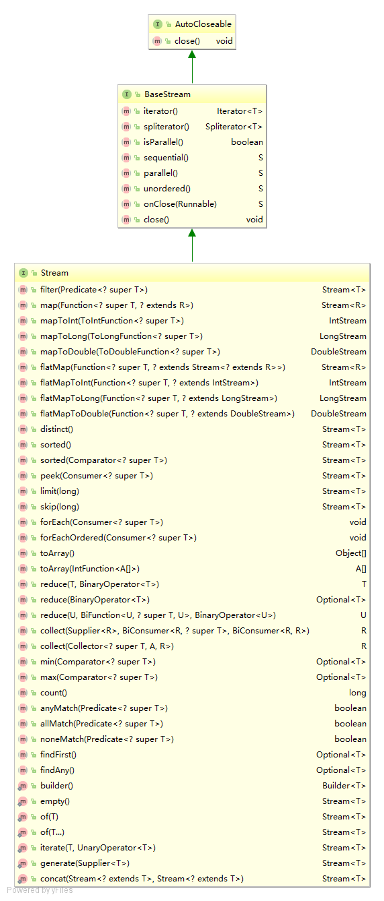
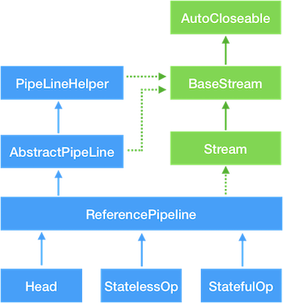
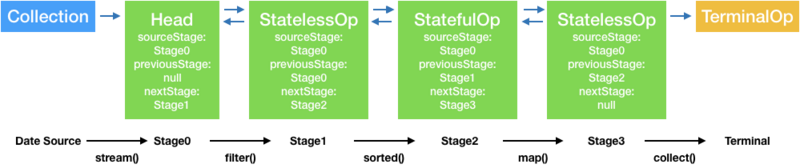

# Java8新特性


##Lambda

表示匿名函数或者闭包的运算符，包含参数列表、函数主题、返回类型，可能还有一个可以抛出的异常列表。

为什么需要lambda表达式：

- 将函数/Lambda作为参数传递给一个方法
- 更充分、简单的利用多核处理器

可以在函数式接口上使用Lambda表达式

### 语法

(parameters) -> expression

（表达式-风格）

或
(parameters) -> { statements; }

（块-风格）

包含三个部分：

- 参数列表
- 箭头
- Lambda主体


###特性

- 可选类型声明：不需要声明参数类型，编译器可以统一识别参数值
- 可选的参数圆括号：一个参数可以无需圆括号，但多个参数需要定义圆括号
- 可选的大括号：如果主体包含了一个语句，就不需要使用大括号
- 可选的返回关键字：如果主体只有一个表达式返回值则编译器会自动返回返回值，大括号需要指定表达式返回了一个数值
- 主要用来定义行内执行的方法类型接口
- 免去了使用匿名方法的麻烦


###示例

根据上述语法规则，以下哪个不是有效的Lambda表达式?

```java
public static void main(String[] args) {
    //1
    //        () -> {};
    //2
    //        () -> "Raoul";
    //3
    //        () -> {return "hello";};
    //4
    //        (Integer i) -> return "cc" + i;
    //5
    //        (String s) -> {"cc";};
}
```

只有(4)和(5)是无效的Lambda，其余都是有效的。详细解释如下

4.return是一个控制流语句。要使此Lambda有效，需要使用花括号

5.“Iron Man”是一个表达式，不是一个语句。要使此Lambda有效，可以去除花括号和分号

### 异常处理

Java提供的API中，所有的函数式接口都不允许抛出受检异常(checked exception)

如果需要lambda表达式抛出异常，有两种方式

1. 定义一个自己的函数式接口，并申明受检异常
2. 显示捕捉受检异常

```java
//自定义函数式接口
@FunctionalInterface
public interface BufferedReaderProcessor {
    String process(BufferedReader br) throws IOException;
}
```


```java
//显示捕捉异常
Function<BufferedReader, String> function = (br) -> {
    try {
        return br.readLine();
    } catch (IOException e) {
        e.printStackTrace();
    }
    return null;
};
```


### 局部变量

Lambda使用局部变量（lambda表达式主体外部变量）

```java
int number = 100;
Runnable r = () -> System.out.println(number);
```

Lambda默认使用final变量，即常量，原因有二

1. 实例变量和局部变量背后的实现有一个关键不同。实例变量都存储在堆中，局部变量则保存在栈上。如果Lambda可以直接访问局部变量，而且Lambda是在一个线程中使用的，则使用Lambda的线程，可能会在分配该变量的线程将这个变量收回之后，去访问该变量。因此，Java在访问自由局部变量时，实际上是在访问它的副本，而不是访问基本变量
2. 这一限制不鼓励你使用改变外部变量的典型命令式编程模式（我们会在以后的各章中解释，这种模式会阻碍很容易做到的并行处理）


### 方法引用

方法引用可以被看作仅仅调用特定方法的Lambda的一种快捷写法。它的基本思想是，如果一个Lambda代表的只是“直接调用这个方法”，那最好还是用名称来调用它，而不是去描述如何调用它

#### 优点

增加可读性

#### 分类

1. 指向静态方法的方法引用

   > Integer::parseInt

2. 指向任意类型实例方法的方法引用

   > String::length

3. 指向现存对象或表达式实例方法的方法引用

   第三种方法引用主要用在你需要在Lambda中调用一个现存外部对象的方法时

   > ()->expensive-Transaction.getValue()

### 构造函数

对于一个现有构造函数，你可以利用它的名称和关键字new来创建它的一个引用：ClassName::new。它的功能与指向静态方法的引用类似


## 函数式接口

###定义

有且仅有一个抽象方法的接口。且该方法不可override java.lang.Object类的public方法。可以使@FunctionalInterface注解申明函数式接口，告诉编译器在编译期检查函数式接口的合法性

函数式接口可以被隐式转换为Lambda表达式，Java8之前使用匿名函数实现，之后用lambda表达式实现

由引用传递到==行为传递==的转变

Java8中核心函数式接口有如下

###Function功能接口

只有apply一个抽象方法，其他为默认方法

提供功能转换

```java
/**
 * Represents a function that accepts one argument and produces a result.
 *
 * <p>This is a <a href="package-summary.html">functional interface</a>
 * whose functional method is {@link #apply(Object)}.
 *
 * @param <T> the type of the input to the function
 * @param <R> the type of the result of the function
 *
 * @since 1.8
 */
@FunctionalInterface
public interface Function<T, R> {

    /**
     * Applies this function to the given argument.
     * 将给定的T类型转换成R类型返回
     * @param t the function argument
     * @return the function result
     */
    R apply(T t);

    /**
     * Returns a composed function that first applies the {@code before}
     * function to its input, and then applies this function to the result.
     * If evaluation of either function throws an exception, it is relayed to
     * the caller of the composed function.
     *
     * @param <V> the type of input to the {@code before} function, and to the
     *           composed function
     * @param before the function to apply before this function is applied
     * @return a composed function that first applies the {@code before}
     * function and then applies this function
     * @throws NullPointerException if before is null
     *
     * @see #andThen(Function)
     */
    default <V> Function<V, R> compose(Function<? super V, ? extends T> before) {
        Objects.requireNonNull(before);
        return (V v) -> apply(before.apply(v));
    }

    /**
     * Returns a composed function that first applies this function to
     * its input, and then applies the {@code after} function to the result.
     * If evaluation of either function throws an exception, it is relayed to
     * the caller of the composed function.
     *
     * @param <V> the type of output of the {@code after} function, and of the
     *           composed function
     * @param after the function to apply after this function is applied
     * @return a composed function that first applies this function and then
     * applies the {@code after} function
     * @throws NullPointerException if after is null
     *
     * @see #compose(Function)
     */
    default <V> Function<T, V> andThen(Function<? super R, ? extends V> after) {
        Objects.requireNonNull(after);
        return (T t) -> after.apply(apply(t));
    }

    /**
     * Returns a function that always returns its input argument.
     *
     * @param <T> the type of the input and output objects to the function
     * @return a function that always returns its input argument
     */
    static <T> Function<T, T> identity() {
        return t -> t;
    }
}
```


###Consumer消费接口

```java
/**
 * Represents an operation that accepts a single input argument and returns no
 * result. Unlike most other functional interfaces, {@code Consumer} is expected
 * to operate via side-effects.
 *
 * <p>This is a <a href="package-summary.html">functional interface</a>
 * whose functional method is {@link #accept(Object)}.
 *
 * @param <T> the type of the input to the operation
 *
 * @since 1.8
 */
@FunctionalInterface
public interface Consumer<T> {

    /**
     * Performs this operation on the given argument.
     *
     * @param t the input argument
     */
    void accept(T t);

    /**
     * Returns a composed {@code Consumer} that performs, in sequence, this
     * operation followed by the {@code after} operation. If performing either
     * operation throws an exception, it is relayed to the caller of the
     * composed operation.  If performing this operation throws an exception,
     * the {@code after} operation will not be performed.
     *
     * @param after the operation to perform after this operation
     * @return a composed {@code Consumer} that performs in sequence this
     * operation followed by the {@code after} operation
     * @throws NullPointerException if {@code after} is null
     */
    //重复使用consumer中数据，实现二次消费
    default Consumer<T> andThen(Consumer<? super T> after) {
        Objects.requireNonNull(after);
        return (T t) -> { accept(t); after.accept(t); };
    }
}
```


- void accept(T t)：接受数据
- Consumer<T> andThen(Consumer<? super T> after)：重复接受数据


示例：

```java
@Test
public void testConsumerInterface(){
    //1.实现accept方法
    //定义consumer
    Consumer consumer = new Consumer() {
        @Override
        public void accept(Object o) {
            System.out.println(o);
        }
    };
    //定义流
    Stream stream = Stream.of("abc", "", "bc", "efg", "abcd","", "jkl");
    //使用consumer
    stream.forEach(consumer);

    //2.lambda表达式返回
    //使用lambda返回consumer
    consumer =  (s) -> System.out.println(s);
    stream = Stream.of("abc", "bc", "efg", "abcd","jkl");
    stream.forEach(consumer);

    //3.方法引用
    //使用方法引用返回consumer
    consumer = System.out::println;
}
```


###Supplier生产接口

```java
/**
 * Represents a supplier of results.
 *
 * <p>There is no requirement that a new or distinct result be returned each
 * time the supplier is invoked.
 *
 * <p>This is a <a href="package-summary.html">functional interface</a>
 * whose functional method is {@link #get()}.
 *
 * @param <T> the type of results supplied by this supplier
 *
 * @since 1.8
 */
@FunctionalInterface
public interface Supplier<T> {

    /**
     * Gets a result.
     * @return a result
     */
    T get();
}
```


###Predicate断言接口


###Operator操作接口


| 序号 | 接口 & 描述                                                  |
| :--- | :----------------------------------------------------------- |
| 1    | **BiConsumer**代表了一个接受两个输入参数的操作，并且不返回任何结果 |
| 2    | **BiFunction**代表了一个接受两个输入参数的方法，并且返回一个结果 |
| 3    | **BinaryOperator**代表了一个作用于于两个同类型操作符的操作，并且返回了操作符同类型的结果 |
| 4    | **BiPredicate**代表了一个两个参数的boolean值方法             |
| 5    | **BooleanSupplier**代表了boolean值结果的提供方               |
| 6    | **Consumer**代表了接受一个输入参数并且无返回的操作           |
| 7    | **DoubleBinaryOperator**代表了作用于两个double值操作符的操作，并且返回了一个double值的结果。 |
| 8    | **DoubleConsumer**代表一个接受double值参数的操作，并且不返回结果。 |
| 9    | **DoubleFunction**代表接受一个double值参数的方法，并且返回结果 |
| 10   | **DoublePredicate**代表一个拥有double值参数的boolean值方法   |
| 11   | **DoubleSupplier**代表一个double值结构的提供方               |
| 12   | **DoubleToIntFunction**接受一个double类型输入，返回一个int类型结果。 |
| 13   | **DoubleToLongFunction**接受一个double类型输入，返回一个long类型结果 |
| 14   | **DoubleUnaryOperator**接受一个参数同为类型double,返回值类型也为double 。 |
| 15   | **Function**接受一个输入参数，返回一个结果。                 |
| 16   | **IntBinaryOperator**接受两个参数同为类型int,返回值类型也为int 。 |
| 17   | **IntConsumer**接受一个int类型的输入参数，无返回值 。        |
| 18   | **IntFunction**接受一个int类型输入参数，返回一个结果 。      |
| 19   | **IntPredicate**：接受一个int输入参数，返回一个布尔值的结果。 |
| 20   | **IntSupplier**无参数，返回一个int类型结果。                 |
| 21   | **IntToDoubleFunction**接受一个int类型输入，返回一个double类型结果 。 |
| 22   | **IntToLongFunction**接受一个int类型输入，返回一个long类型结果。 |
| 23   | **IntUnaryOperator**接受一个参数同为类型int,返回值类型也为int 。 |
| 24   | **LongBinaryOperator**接受两个参数同为类型long,返回值类型也为long。 |
| 25   | **LongConsumer**接受一个long类型的输入参数，无返回值。       |
| 26   | **LongFunction**接受一个long类型输入参数，返回一个结果。     |
| 27   | **LongPredicate**R接受一个long输入参数，返回一个布尔值类型结果。 |
| 28   | **LongSupplier**无参数，返回一个结果long类型的值。           |
| 29   | **LongToDoubleFunction**接受一个long类型输入，返回一个double类型结果。 |
| 30   | **LongToIntFunction**接受一个long类型输入，返回一个int类型结果。 |
| 31   | **LongUnaryOperator**接受一个参数同为类型long,返回值类型也为long。 |
| 32   | **ObjDoubleConsumer**接受一个object类型和一个double类型的输入参数，无返回值。 |
| 33   | **ObjIntConsumer**接受一个object类型和一个int类型的输入参数，无返回值。 |
| 34   | **ObjLongConsumer**接受一个object类型和一个long类型的输入参数，无返回值。 |
| 35   | **Predicate**接受一个输入参数，返回一个布尔值结果。          |
| 36   | **Supplier**无参数，返回一个结果。                           |
| 37   | **ToDoubleBiFunction**接受两个输入参数，返回一个double类型结果 |
| 38   | **ToDoubleFunction**接受一个输入参数，返回一个double类型结果 |
| 39   | **ToIntBiFunction**接受两个输入参数，返回一个int类型结果。   |
| 40   | **ToIntFunction**接受一个输入参数，返回一个int类型结果。     |
| 41   | **ToLongBiFunction**接受两个输入参数，返回一个long类型结果。 |
| 42   | **ToLongFunction**接受一个输入参数，返回一个long类型结果。   |
| 43   | **UnaryOperator**接受一个参数为类型T,返回值类型也为T。       |


## 默认方法

###1.default method

接口可以有实现方法，而且不需要实现类实现其方法。在方法前加"default"关键字。==解决接口的修改与现有的实现不兼容问题==。

示例：

```java
public interface Vehicle {
   default void print(){
      System.out.println("我是一辆车!");
   }
}
 
public interface FourWheeler {
   default void print(){
      System.out.println("我是一辆四轮车!");
   }
}

//方式一：创建自己的默认方法，重写接口的默认方法
public class Car implements Vehicle, FourWheeler {
   default void print(){
      System.out.println("我是一辆四轮汽车!");
   }
}
//方式二：使用super调用指定的接口的默认方法
public class Car implements Vehicle, FourWheeler {
   public void print(){
      Vehicle.super.print();
   }
}
```


###2.static default method

示例：

```java
public interface Vehicle {
   default void print(){
      System.out.println("我是一辆车!");
   }
    // 静态方法
   static void blowHorn(){
      System.out.println("按喇叭!!!");
   }
}
```


## Stream

Stream是java8中新提供给开发者一组操作集合的API，将要处理的元素看作一种流，流在管道中传输，并可以在管道的节点上进行处理，比如排序、筛选、聚合等。

以声明的方式处理数据

基础特征：

- **Pipelining**: 中间操作都会返回流对象本身。 这样多个操作可以串联成一个管道。 这样做可以对操作进行优化， 比如延迟执行(laziness)和短路( short-circuiting)。
- **内部迭代**： 以前对集合遍历都是通过Iterator或者For-Each的方式, 显式的在集合外部进行迭代， 这叫做外部迭代。 Stream提供了内部迭代的方式， 通过访问者模式(Visitor)实现。

操作类型：

###中间操作

将流一层层处理，并向下一层传递。比如sorted, filter, map, flatmap等

中间操作分为两种状态：stateful和stateless，及有状态和无状态

- stateful：必须等上一步操作完拿到全部元素后才可操作，如sorted
- stateless：该操作的数据不收上一步操作的影响，如filter map

###终止操作

触发数据流动，并收集结果。比如forEach，collect等

终止操作分为短路操作（short-circuiting）和非短路操作（none-short-circuiting）

- short-circuiting：会在适当时刻终止遍历
- none-short-circuiting：会遍历所有元素

类图：



###Stream继承关系




Stream中使用Stage的概念描述一个完整的操作，并用某种实例化后的Pipeline来代表Stage，将各种Pipeline按照先后顺序连接到一起，形成流水线

Head为ReferencePipeline的内部类，表示第一个Stage，不包含任何操作，StatelessOp和StatefulOp分别为无状态操作和有状态的Stage。




使用Collection.stream、Arrays.stream或Stream.of等接口会生成Head，其内部均采用StreamSupport.stream方法，将原始数据包装为Spliterator存放在Stage中

- Head记录Stream起始操作，将包装为Spliterator的原始数据存放在Stage中
- StatelessOp记录无状态的中间操作
- StatefulOp记录有状态的中间操作
- TerminalOp用于触发数据数据在各Stage间的流动及处理，并收集最终数据


###1.使用集合(Collection)生成Stream

- **stream()** − 为集合创建串行流。
- **parallelStream()** − 为集合创建并行流。

示例：

```java
List<String> strings = Arrays.asList("abc", "", "bc", "efg", "abcd","", "jkl");
Stream<String> stream = strings.stream().sorted().filter(c -> c.startsWith("ab"));
stream.forEach(s -> {
    System.out.println(s);
});
Stream<String> parallelSteam = strings.parallelStream().sorted();
parallelSteam.forEach(s -> {
    System.out.println(s);
});
```


###2.使用IO/NIO生成Stream

- **lines()** − 为BufferReader创建串行流。


### 3.使用生产器Generator生成Stream


### 4.使用数组(Arrays)产生Stream

- **stream(T[] array)** − 为集合创建Stream。
- **stream(T[] array, int startInclusive, int endExclusive)** − 为集合创建Stream。
- **IntStream stream(int[] array)** − 为数组创建IntStream 
- **LongStream stream(long[] array)** − 为数组创建LongStream 
- **DoubleStream stream(double[] array)** − 为数组创建DoubleStream 


###5.使用聚合操作产生Stream

 比如filter, map, reduce, find, match, sorted等。

示例：

```java
List<String> strings = Arrays.asList("abc", "", "bc", "efg", "abcd","", "jkl");
Stream<String> stream = strings.stream().sorted().filter(c -> c.startsWith("ab"));
```

